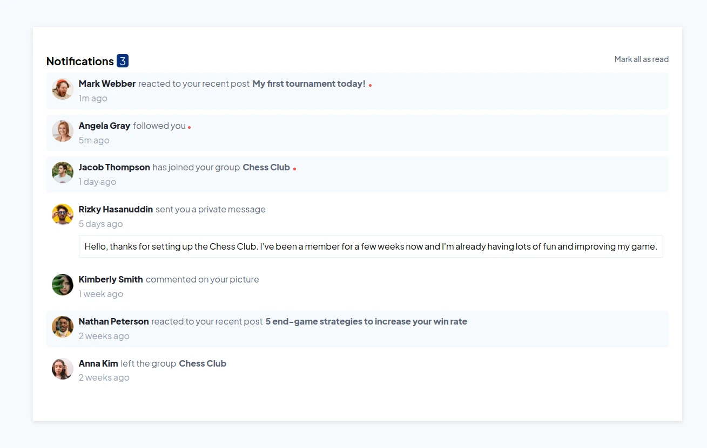

# Frontend Mentor - Notifications page solution

This is a solution to the [Notifications page challenge on Frontend Mentor](https://www.frontendmentor.io/challenges/notifications-page-DqK5QAmKbC). Frontend Mentor challenges help you improve your coding skills by building realistic projects.

## Table of contents

- [Overview](#overview)
  - [Screenshot](#screenshot)
  - [Links](#links)
- [My process](#my-process)
  - [Built with](#built-with)
  - [Continued development](#continued-development)
- [Author](#author)

## Overview

In this project I reinforced practices of dom manipulation, functions. I mastered javascript with consistency.

### Screenshot

### Links

- Solution URL: [click here](https://github.com/ronitzdev/notifications-dom)
- Live Site URL: [click here](https://dom-notifications-ronitzdev.netlify.app/)

## My process

### Built with

- Semantic HTML5 markup
- CSS custom properties
- Flexbox
- Mobile to desktop workflow
- Media queries

### Continued development

Each project will increase in difficulty in order to gain experience to opt for other projects and projects of higher difficulty. Taking into account my current status and the future goal to achieve.

## Author

- Website GitHub - [ronitzdev](https://github.com/ronitzdev)
- LinkedIn - [@ronitzdev](https://www.linkedin.com/in/ronitzdev/)
